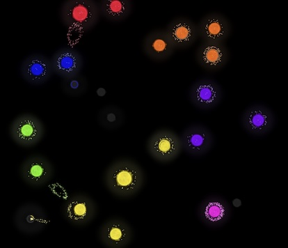

# Senalumi

A very simple real-time strategy game heavily inspired by [Auralux](http://auraluxconstellations.com/).

Try is live: https://lloydmarkle.github.io/senalumi/



## Description

Mostly a project created for my own interest to play with pixijs. I was (and am) a big fan of the original Auralux but
always wanted more colours and opponents. Someday, I'd like to add multiplayer so I can play together with my kids.

## Getting Started

Install NodeJS 16 or higher and run:
```
## Install NodeJS dependencies
npm install
## Run dev server
npm run dev
```
Open your web browser to http://localhost:5173 and play!

## License

This content is released under [the MIT License](http://opensource.org/licenses/MIT).

## FAQ

### The game runs slow, what do I do?
There are a few inefficiencies in the implementation. I've got some ideas to improve performance both of the pixijs renderer
and the game logic but those changes will take time. Feel free to send a PR if you've got ideas!

### What does _Senalumi_ mean?
It's a made up word. I was mulling over a few names mostly based on how they sound and settled on this. The word is made of
two parts which do have some relevant meaning (but it's mostly coincidence):

- Sena: means "army" in Hindi and is also a short form of the name of a Greek goddess of the moon, Selene.
- Lumi: meaning "light" in Latin.

So put together, Senalumi could mean "army of light" or "moon of light" both of which make sense.
